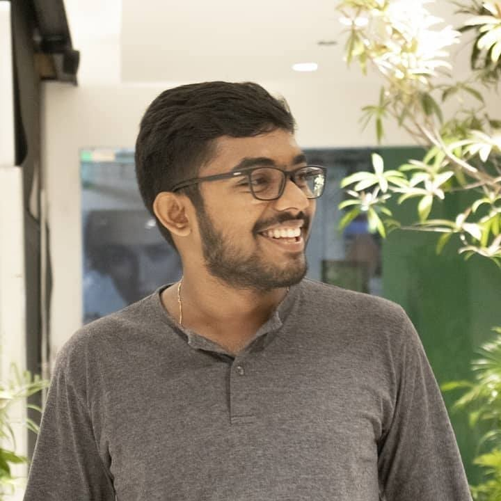

# SLIIT FOSS Events Docs

### Postman API 101 workshop | 2021/09/27 | 7.00P.M - 8.30P.M | YT & FB Live

 

---

### <u>Speaker Details</u>

 

Speaker Kaveesha Gimhana

As a Postman Student Leader, Kaveesha Gimhana advocates for API literacy among peers and enthusiasts by hosting workshops that uncover how one could tap into the power of APIs.
A trainee full stack developer at Omobio (pvt) Ltd with a passion for free and open-source software, he champions for this cause and encourages the growth and awareness of this community as the treasurer of the Free and Open-Source Software Community of Sri Lanka Institute of Information Technology ( SLIIT ) and as a co-host on FOSSCAST, a podcast covering the world of free and open-source technology brought by the FOSS Community of SLIIT.
With experience in cloud computing and DevOps as a full stack developer and having reached 6 years of experience in UI/UX designing, he is also interested and skilled in audio production with experience in composing music and as a lyricist.
Connect with Kaveesha or get a glimpse of his work on:

1. Twitter: https://twitter.com/KaveeshaGimha
2. GitHub: https://github.com/KaveeshaG
3. Dribble: https://dribbble.com/kaveesha
4. Medium: https://medium.com/@KaveeshaG
5. Website: https://kaveeshagimhana.com/

---

### Event Status

- [x] Event name: Postman API 101 workshop :heavy_check_mark:
- [x] Event date: 2021/09/08 :heavy_check_mark:
- [x] Event location: YT & FBLive :heavy_check_mark:
- [x] Event social media: YT & FB :heavy_check_mark:
- [x] Event description: :heavy_check_mark:
      `Postman API 101 workshop on how to make it easy for developers to create, share, test, and document APIs via postman`

---

#### Event Posts Status

| Post Type               | Status  |
| ----------------------- | ------- |
| Coming Soon Post        | Done 👍 |
| Happening Tomorrow Post | Done 👍 |
| Happening Today Post    | Done 👍 |
| Happening Now Post      | Done 👍 |

[Posts](https://drive.google.com/drive/u/0/folders/1ZDAlx0dIrKSJ6A92E0QFJwYZkfwLthpj)

#### Event Post Captions Status

| Post Type               | Status  |
| ----------------------- | ------- |
| Coming Soon Post        | Done 👍 |
| Happening Tomorrow Post | Done 👍 |
| Happening Today Post    | Done 👍 |
| Happening Now Post      | Done 👍 |

[Captions](https://drive.google.com/drive/u/0/folders/1wcODXdnNcfqqjwlo1vkOmp-bgxiKkWX3)

---

` Streaming platforms : YouTube & Facebook -> confirmed 👍`
` Streaming Member Name : Sahas -> confirmed 👍`

---
